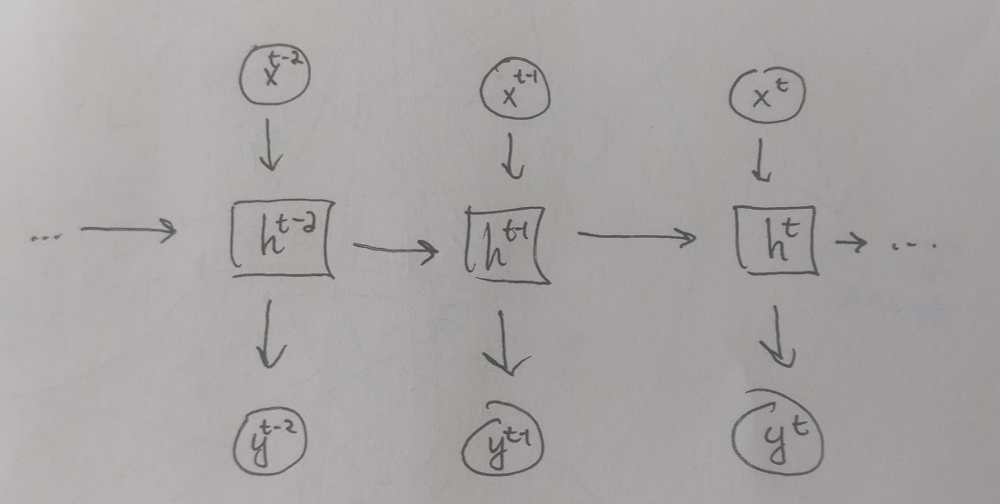

# METL
## TP2
Tientso Ning

1. Perplexity and corresponding CE loss is defined as:

$P P^{(t)}\left(y^{(t)}, \hat{y}^{(t)}\right)=\frac{1}{p\left(x_{t+1}^{p r e d}=x_{t+1} | x_{t}, \ldots, x_{1}\right)}=\frac{1}{\sum_{j=1}^{|V|} y_{j}^{(t)} \cdot \hat{y}_{j}^{(t)}}$

$=-\sum_{i=1}^{|V|} y_{i}^{(t)} \cdot \log \hat{y}_{i}^{(t)}$

Since we have a one hot representation, there will be only one non-zero slot.

$=-y_{i}(t) \cdot \log \left(\hat{y}_{i}(t)\right)$
$=\quad-\log \left(\hat{y}_{i}(t)\right)$

$=\log (1)-\log \left(\hat{y}_{i}^{(t)}\right)$
$=\log \left(\frac{1}{\hat{y}_{i}(t)}\right),$ when $P p=\frac{1}{\hat{y}(t)}$

Therefore $C E\left(y^{(t)}, \hat{y}^{(t)}\right)=\log P p^{(t)}\left(y^{(t)}, \hat{y}^{(t)}\right)$

For |V| = 2000, and |V| = 10,000
`log(2000) = 7.600902459542082`
`log(10000) = 9.210340371976184`

For a vocab of |V| words, complete randomness would mean all have the same probabilities 1/|V|. Therefore Perplexity will be |V|.

2. Derive the gradients.

$\frac{\partial J^{(t)}}{\partial U}=\left(h^{(t)}\right)^{\top}(\hat{y}-y)$

Where $h^{(t)}$ is the hidden-layer output at time t, and $\hat{y}-y$ is our cost function derivative. Since the value is a partial derivative, the derivative of $h^{(t)}U + b_{2}$ with respect to U would be $h^{(t)}$ due to the constant multiple rule of derivatives.

$\frac{\partial J^{(t)}}{\partial b_{2}}=(\hat{y}-y)$  Same from above, since the value is a partial derivative, the derivative of $h^{(t)}U + b_{2}$ with respect to $b_{2}$ would just be 1, due to the constant multiple rule of derivatives.

$\left.\frac{\partial J^{(t)}}{\partial b_{i}}\right|_{t}=\frac{\partial J^{(t)}}{\partial h^{(t)}} \odot \theta^{\prime}\left(h^{(t-1)} H+e^{(t)} I+b\right)$

The values in the sigmoid are $h^{(t-1)}H$, which is the hidden layer, $e^{(t)}I$ corresponds to the embedding matrix of the input representation, with bias b1.

$\frac{\partial J^{(4)}}{\partial L_{x}^{(H)}}=\frac{\partial J^{(t)}}{\partial e^{(t)}}=\left.\frac{\partial J^{(t)}}{\partial b_{1}}\right|_{t} \cdot I^{\top}$

from the values inside the sigmoid above.

$\left.\frac{\partial J^{(t)}}{\partial I}\right|_{t}=\left.\left(e^{(t)}\right)^{\top} \cdot \frac{\partial J^{(t)}}{\partial b1}\right|_{t}$

same as above, but for the other term in the sigmoid.

$\left.\frac{\partial J^{(t)}}{\partial t t}\right|_{t}=\left.\left(h^{(t-1)}\right)^{\top} \frac{\partial J^{(t)}}{\partial b_{i}}\right|_{t}$
$\frac{\partial J^{(t)}}{\partial h^{(t-1)}}=\left.H^{T} \frac{\partial J^{(t)}}{\partial b_{1}}\right|_{t}$

3. Draw an unrolled RNN and derive gradients.

$\delta^{(t-1)}=\frac{\partial J^{(t)}}{\partial h^{(t-1)}}$ is the error term.

$\begin{aligned}\left.\frac{\partial J^{(t)}}{\partial b_{1}}\right|_{t-1} &=\frac{\partial J^{(t)}}{\partial h^{(t-1)}} \odot \theta^{\prime}\left(h^{(t-2)} H+e^{(t-1)} I+b_{1}\right) \\ &=\delta^{(t-1)} \odot \theta^{\prime}\left(h^{(t-2)} H+e^{(t+1)} I+b_{1}\right) \end{aligned}$

from the sigmoid application, which is an element-wise application, at the layers. Where the values $h^{t-2}H$ from the hidden layer, $e^{(t-1)}I$ is from the embedding representation with b1 bias.

$\frac{\partial J^{(t)}}{\partial L_{x}^{(t-1)}}=\left.\frac{\partial J^{(t)}}{\partial b_{i}}\right|_{t-1} I^{T}$

Since $L_{x}^{(t-1)}$ is the column corresponding to the word x at time t-1, and $e^{t}=x^{t}L$ where I is the input word representation.

$\left.\frac{\partial J^{(t)}}{\partial I}\right|_{t-1}=\left.\left(e^{(t-1)}\right)^{T} \cdot \frac{\partial J^{(t)}}{\partial b_{1}}\right|_{t-1}$

$\left.\frac{\partial J^{(t)}}{\partial(H)}\right)_{t-1}=\left.\left(h^{t-2}\right)^{T} \cdot \frac{\partial J(t)}{\partial b_{1}}\right|_{t-1}$

both from the terms in the sigmoid above.

4. Define the complexities.

$h^{(t-1)}=d\left(D_{h}\right)$
$e^{(t)}=O(d)$
$\hat{y}^{(t)}=O(|V|)$

$e^{t}$ is $x_{t} L$, meaning O(d) since d is the embedding dimension. L is size d.
$h^{(t)}$ and $\hat{y}^{t}$ are derived from derivatives.
Forwards and backwards have the same time complexity and z is just a scalar to complexity.

The slow step is calculating $\hat{y}^{t}$ since the application of the softmax would require the dimension to be of |V|, and the vocabulary sizes can be big. We can be working in the magnitudes of hundreds or thousands of words.
