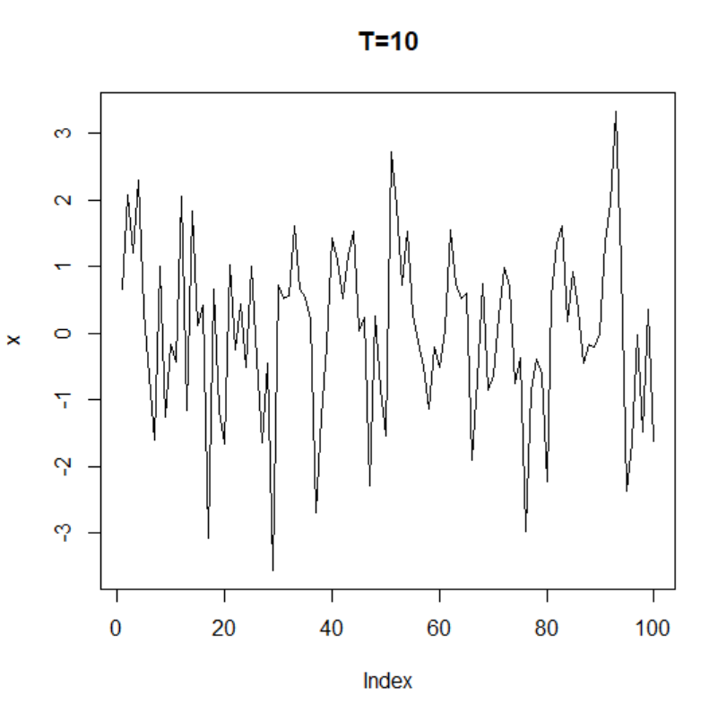
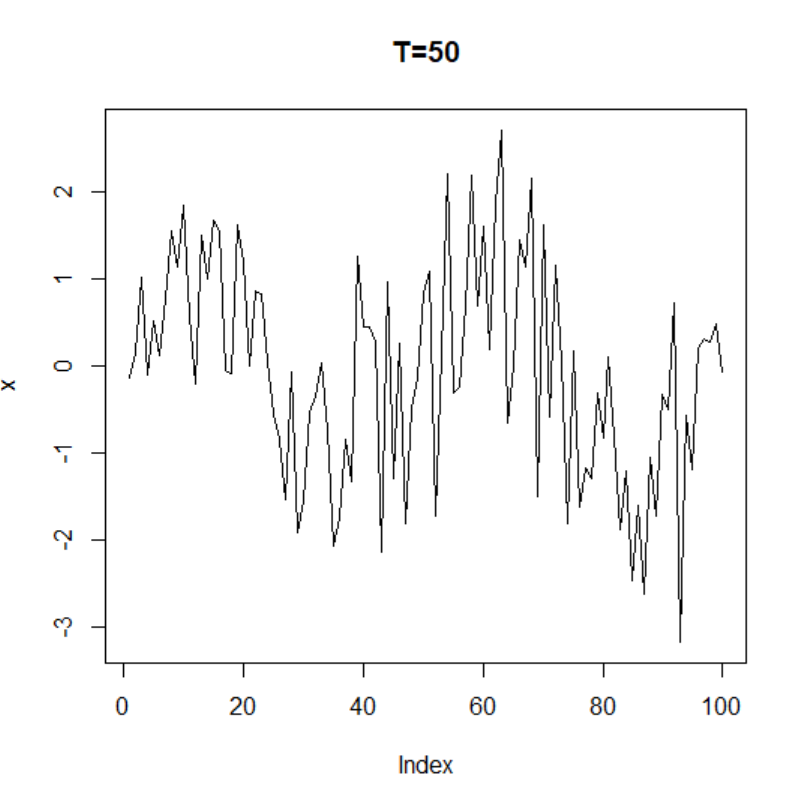
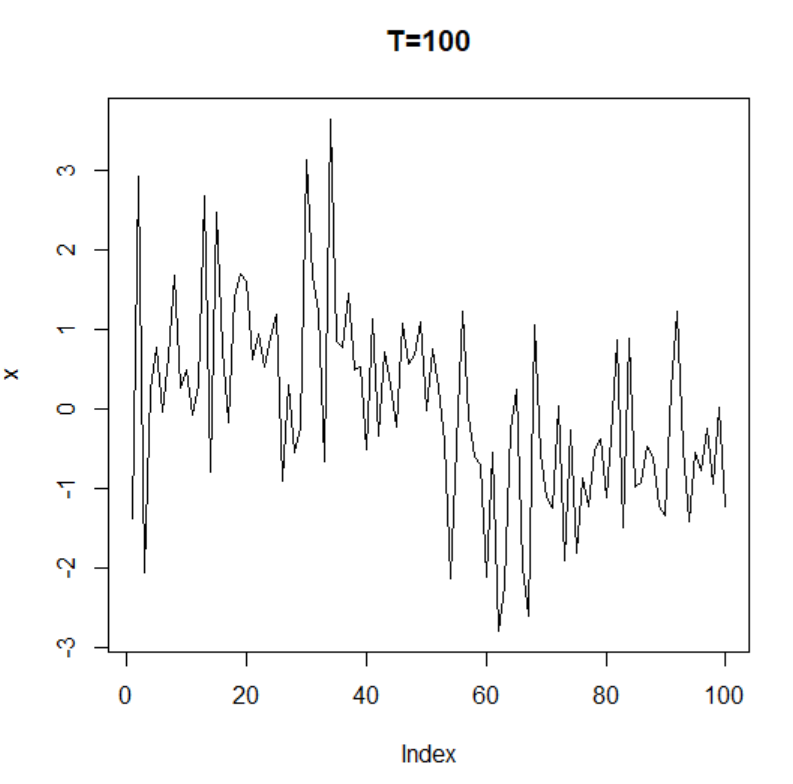
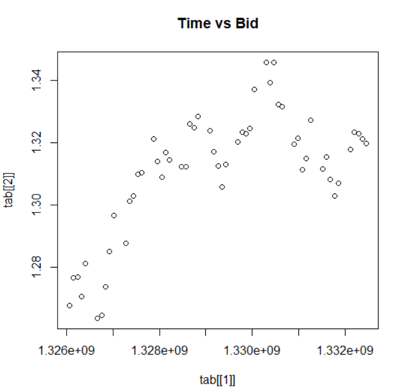
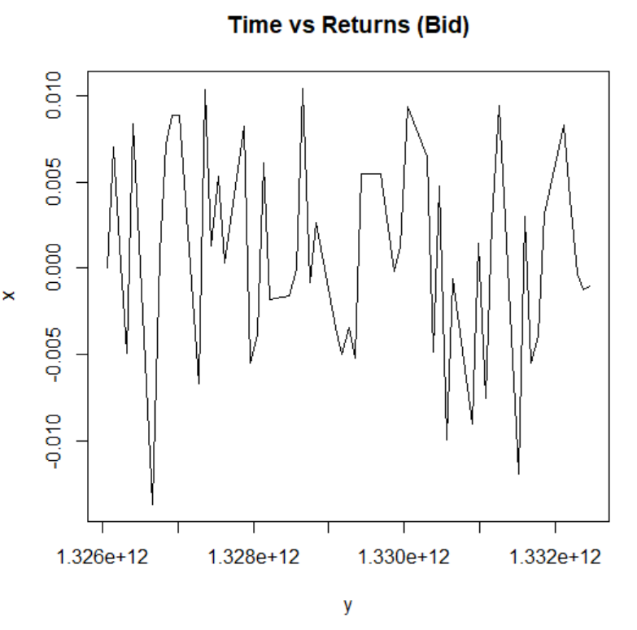
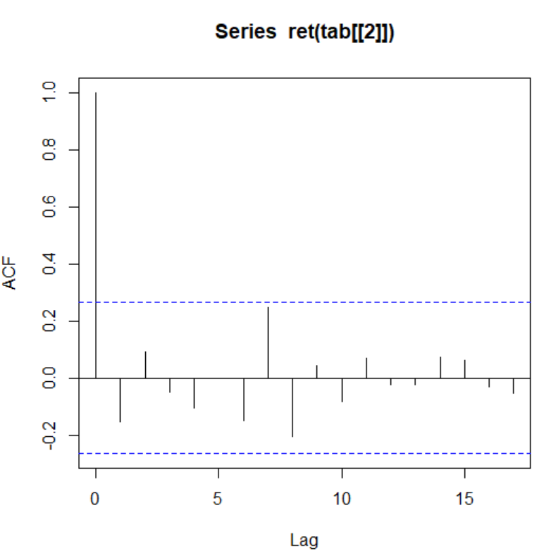

# Computational Finance
## Series 2
Tientso Ning

### 1. Correlation of two series

###### 1. Compute the Correlation between X and Y
The correlation between X and Y is
* `0.8591271`

###### 2. Draw the Graph

Image 1: Graph of X vs Y

###### 3. Is the slope equal to the correlation coefficient?
The slope is trending positively, and looks close to a slope of 1. This reflects well with the fact that the correlation between X and Y was calculated to be `0.8591271`, which is close to 1, but is not the same.

### 2. Hidden Sine
We notice that when the T is big, we can see that the ACF is less stationary, and there are more evident trends while when the T is lower we can see that the ACF is more stationary.

Image 2: T = 10

Image 3: T = 50

Image 4: T = 100

### 3. Modeling empirical series
The evolution of the time series as shown is not stationary. There is a clear trend towards an increase over time.

Image 5: Time vs Bid

The returns however, is more stationary, as we can see that we've sort of "removed" the upwards trend over time.

Image 6: Time vs Returns of Bid

The ACF of the Returns is shown below:

Image 7: ACF of Returns

The autoregression AR(1) according to R is: `0.8782`

The order of the autoregressive model is the number of preceding values to predict the present value at the current time, meaning that it could improve the quality of the prediction, but not necessarily always improve the quality.
