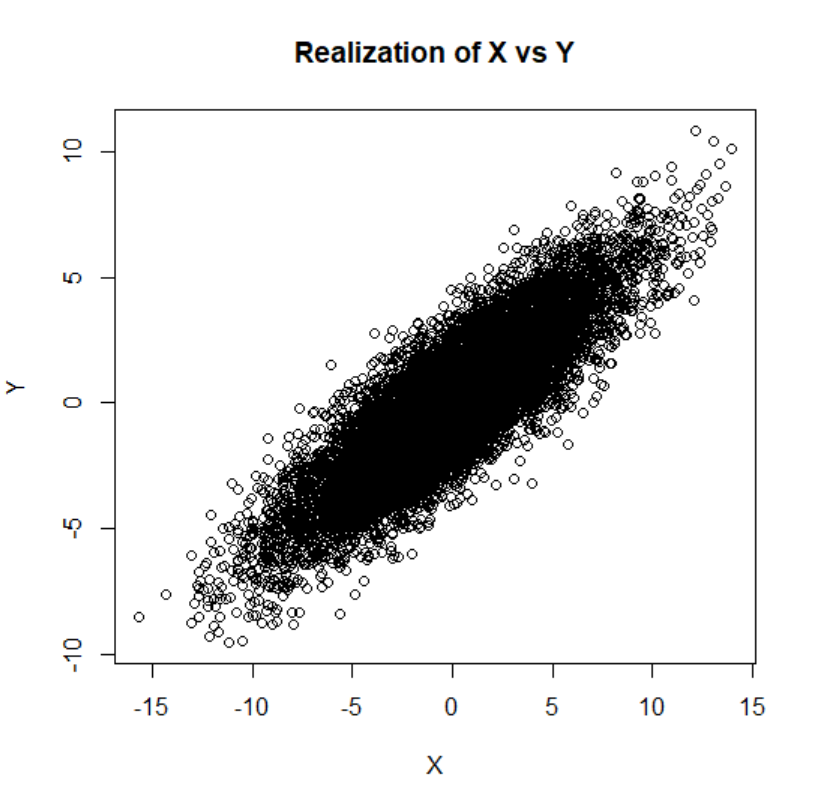

# Computational Finance
## Series 2
Tientso Ning

### 1. Correlation of two series

###### 1. Compute the Correlation between X and Y
The correlation between X and Y is
* `0.8591271`

###### 2. Draw the Graph

Image 1: Graph of X vs Y

###### 3. Is the slope equal to the correlation coefficient?
The slope is trending positively, and looks close to a slope of 1. This reflects well with the fact that the correlation between X and Y was calculated to be `0.8591271`, which is close to 1, but is not the same.

### 2. Hidden Sine
//Explain the graphs

### 3. Modeling empirical series
