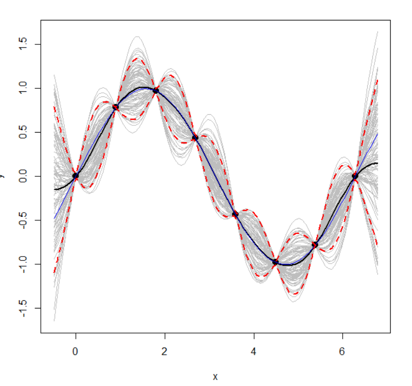
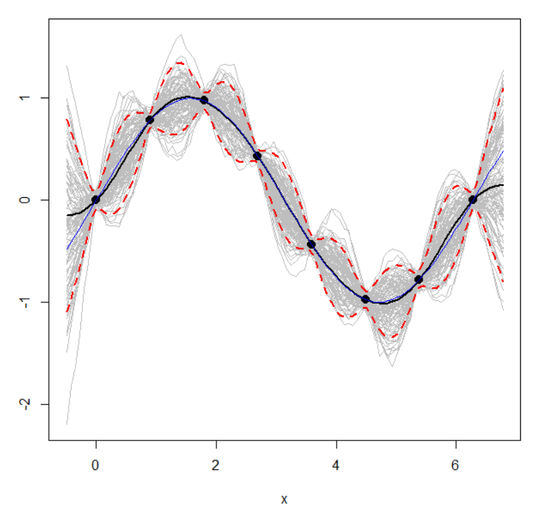

# Selected Topics - Gaussian Process
Tientso Ning

## Code Provided
Code is provided in the `gaussianProcess.r` file.

## Exercises
1. 

2. When `n` changes, the "amplitude" of the gray lines changes, getting tighter or looser based on whether you increase or decrease the value of `n` respectively. When `m` is altered, the gray lines become more or less jagged depending on whether you decrease or increase the value of `m` respectively.

3. Please refer to the code to confirm that the values are indeed equal, as well as identical. The variance is also provided as an output.

4. The interpolation is a non-linear regression, since the GP has degrees of freedom (here represented by the gray lines falling within the red dotted lines, and the blue representing the average).

5. When `x*` is taken to be all the same values of `x`, the result is that the predicted values becomes entirely just the defined x, or "overfitting".

6. When we add "uncertainty" to the code, the resulting image is as follows:

We can see that the predicted values become less smooth.
