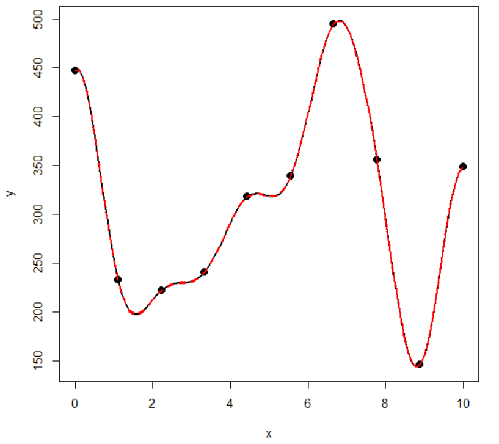
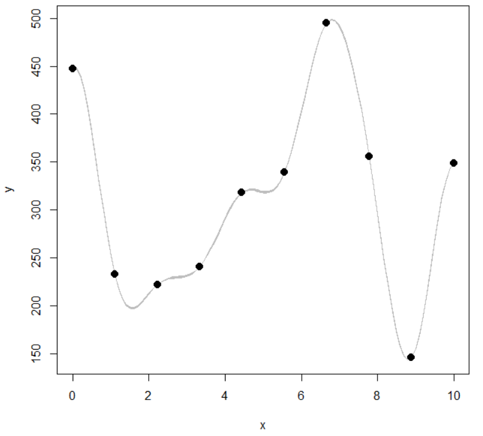

# Selected Topics - Gaussian Process
Tientso Ning

## Code

```
library(plgp)

#create some data
n <-10
x <- matrix(seq(0,10, length=n), ncol=1)
#x, representing the locations
y <- c(447, 233, 222, 241, 318, 339, 495, 356, 146, 349)
#y, representing the prices (historically)

D <- distance(x)
ep_yy <- exp(-D) + diag(1e-8,ncol(D))
m <- 100

x_star <- matrix(seq(0, 10, length=m), ncol=1)
#x_star, representing possible considerations

D_starstar <- distance(x_star)
ep_ystarystar <- exp(-D_starstar) + diag(1e-8, ncol(D_starstar))
D_star <- distance(x_star, x)
ep_ystary <- exp(-D_star)
ep_yy_inv <- solve(ep_yy)
A <- ep_ystarystar - ep_ystary%*%ep_yy_inv%*%t(ep_ystary)
b <- ep_ystary%*%ep_yy_inv%*%y
sample <- 100
y_star <- rmvnorm(sample, b, A)

#plotting
matplot(x_star, t(y_star), type="l", col="gray", lty=1, xlab="x",
ylab="y")
points(x,y, pch=20, cex=2)
lines(x_star, b, lwd=2)

q1 <- b + qnorm(0.05, 0, sqrt(diag(A)))
q2 <- b + qnorm(0.95, 0, sqrt(diag(A)))

lines(x_star, q1, lwd=2, lty=2, col="red")
lines(x_star, q2, lwd=2, lty=2, col="red")
```

## Description of Data
We selected 10 locations, represented by variable `x` and provided the historical prices of these locations as variable `y`. These prices were generated randomly using Google (capped between `100` and `500`, but we could generate these in R natively as well), and for the sake of context, we will consider them as in the scale of `$1,000 USD` (i.e: `233` represents `$233,000 USD`).

Using the GP, we can see relatively simply from the graph (Figure 1) that the best prices are locations close to 1~4 as well as location 9.

For clarity, due to the small number of values in consideration, we provide the figure without additional markings (Figure 2).


## References



