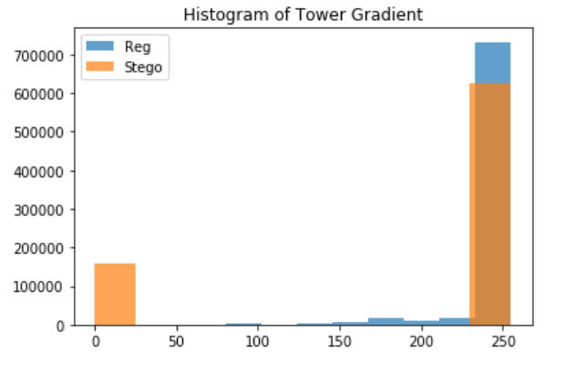

# Steganography
## Exercise 3
Tientso Ning

## Task 1 - Understand the Feature Extraction based on steerable Gaussian Filter Banks
Here, the idea behind steerable Gaussian Filter Banks is that these sets of filters extracts information along the given angle (from 0 to 180).These different filters provide us with different information regarding the image that we run through these filters.

The idea is that we are able to obtain some sort of information that we would otherwise miss by looking at the gradients and tangent derivatives, and ultimately running these features through our classifiers (that we looked at in the previous exercise).

## Task 2 - Generation of Stego Images
Generation of the images shown below can be found via the Jupyter Notebook file.

Stego images were generated via creating an image of Gaussian noise, and embedding that into the LSB layer of the original image.

Image 1: Stego Image of the Tower

Image 2: Stego Image of the Lake

## Task 3 - Stego Images Detection
Here, we provided the comparison images of the gradients and we can see that in the gradients we can spot some sort of abnormalities in both the Lake and the Tower images. The histogram of the gradients also shows us some of the discrepancies.

Ultimately these features would be used in a classifier (like the ones we have seen in previous exercises as well as in class), but examining the image also gives us an idea about how these features are useful in detection.

Image 3: Tower Gradient Comparison

Image 4: Lake Gradient Comparison

Image 5: Histogram of the Tower Gradient

Image 6: Histogram of the Lake Gradient
